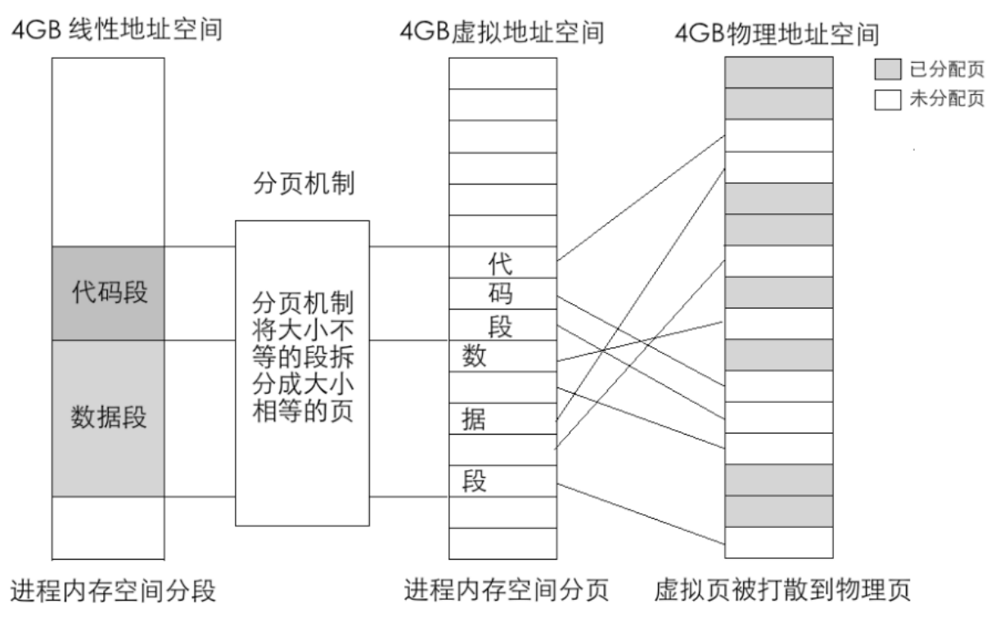

### 系统启动过程
- 按下电源
- 硬件运行
    - 硬件将BIOS ROM加载到内存
        - bios代码和数据保存到bios硬件ROM中。
        - 系统启动后硬件将ROM中的代码和数据加载到1MB空间的最后，即地址0xF00000-0xFFFFF处。只要访问此处的内存地址便是访问了BIOS的代码和数据。
    - CPU的cs:ip寄存器被硬件强制初始化为即0xF000:0xFFF0（0xFFF0），该地址保存了16B（从0xFFF0开始的16B）的指令，该指令是一个跳转指令（jmpf 0xf000:e05b）
    - CPU执行跳转指令，跳转到BIOS程序到入口位置（0xfe05b）
- BIOS程序开始执行
    - 进行硬件外设的检查，最后一个检查是检查启动盘磁盘0盘0道第一扇区是否是引导程序MBR
        - MBR程序大小固定为512KB，即一个扇区到大小，MBR引导程序最后的两个字节分别是0x55和0xaa，供BIOS识别是否为MBR程序用。
        - MBR程序主体内容如果不够512KB，用0填充。
- MBR（master boot Record）开始执行
    - MBR 加载loader程序，loader程序负责初始化OS
    - BIOS程序最后一条指令跳转到主引导程序MBR地址（0x7c00）
- loader程序运行
    - 定义数据结构
    - 准备进入保护模式
        - 打开A20
        - 加载GDT
        - cr0第0位置1

### 段描述符

段描述符用于在保护模式中保存各个段(数据段，程序段，堆，栈等)的段基址。

段描述符保存在GDT和LDT中。

### GDT（Global Descriptor Table)

GDT是描述符的数组，数组中每一项是8字节的描述符。可以用段选择子（segment selector）中提供的下标在GDT中查找描述符

GDT位于内存中，需要用专门的寄存器保存GDT的地址，CPU才知道它在哪里。这个专门的寄存器是GDTR（GDT Register）。

GDTR中前32位保存了GDT在内存中的地址，后16位保存了GDT的界限，又因为每个描述符8字节，因此GDT最多可由2^16/8=8192个描述符

### segment selector

在实模式下，段基址保存在段寄存器CS、DS、ES、FS、GS、SS中。

在保护模式中，段基址保存在段描述符中，段寄存器中保存段是段selector。

可以把selector看成是对GDT以及LDT的索引，通过GDTR + Selector在GDT或LDT中确定一个描述符, 而描述符中保存者段基址信息.

### 页表

开启内存分页功能后，经过分段功能得到段线性地址不在等同于物理地址，而是一个虚拟地址，虚拟地址需通过页表找到真正的物理地址。

页表的地址保存在cr3寄存器中，cr3寄存器中的地址 + 线性地址的页地址（页偏移）就是该页的物理地址，页的物理地址再加上线性地址的页表项目（PTE）地址（偏移）就是最终真实的物理地址。

每个进程都有自己的页表，如果采用一级页表，每个页表大小为 4B（每个） * 1MB（个页表）= 4MB，进程很多时，页表就占用了大量内存。现代操作系统采用多级页表。

在多级页表结构中，每页仍然是4KB。

每个页表中可容纳 1024 个物理页，故每个页表可表示的内存容量是 1024 * 4KB=4MB。页目录中有1024个页表，故所有页表可表示的内存容量是1024 * 4MB=4GB。

页表目录（PD）在内存中的地址保存在cr3寄存器（又称PDPR）中，线程切换时需要刷新该寄存器地址。

每个进程需要保存一份页目录表，如果页目录表的内容为空，则无需保存页表。

### ELF(Executable and Linkable Format)

### TSS(Task State Segment)
- 每个任务都有的结构。
- 保存任务的寄存器值。
    - 每个任务每个特权级都必须有一个栈，这些栈的基址和偏移量页保存在TSS上。
    - TSS由 TR（Task Register）寄存器保存，任务切换时页需要更新此寄存器的内容。
